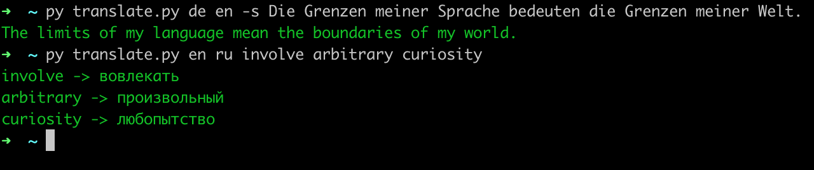

# Translate individual words and sentences from any language to any language fast in terminal

Surely everyone has a situation where a word pops into their head, but not its translation. This script allows you to quickly translate a word or sentence.

## Installation
0. Clone this repository first  
1. `cd translate`
2. `pip3 install requirements.txt`
3. Next, I recommend you move the file to your home directory so that you can shorten the path to the file and run it quickly.

If all went well, you can run the file. 

### Run 🚀
#### Translation of words separately 
`python3 translate.py lang_from lang_to word1 word2 word3`

lang_from – the language from which you want to translate (ex. ru, en, es, de, etc.)  
lang_to – the language you want to translate into (ex. ru, en, es, de, etc.)

#### Translation of the entire sentence
`python3 translate.py en ru -s This is an example of a sentence`

#### Real example

# TODO 
- [ ] translate words by all chosen langauges